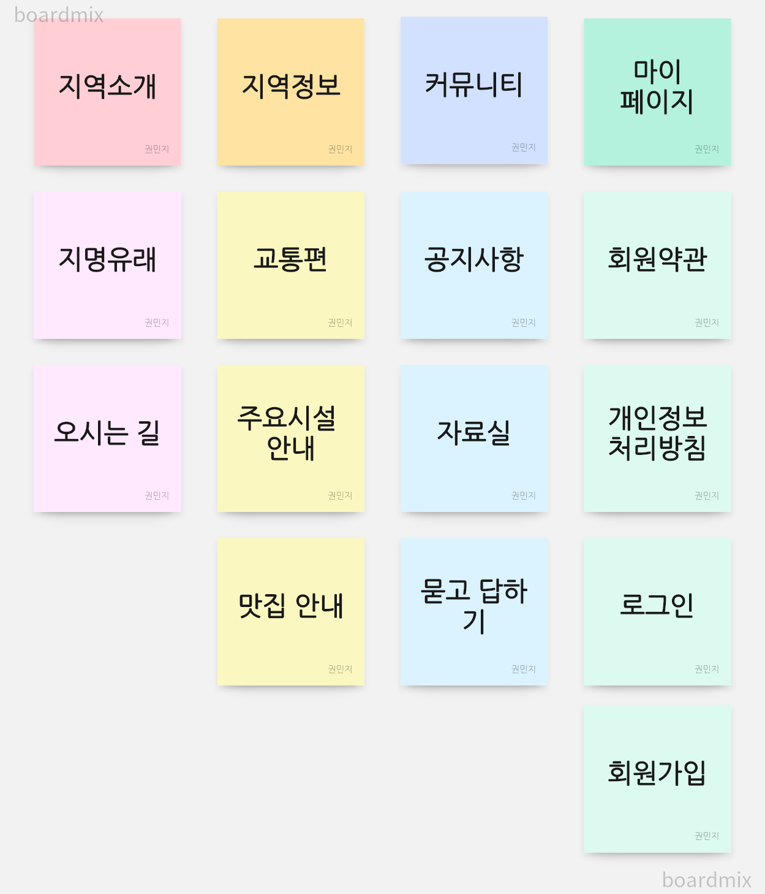
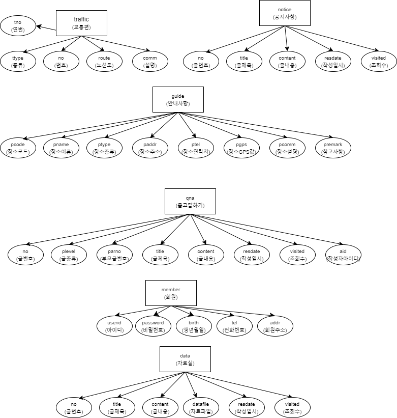
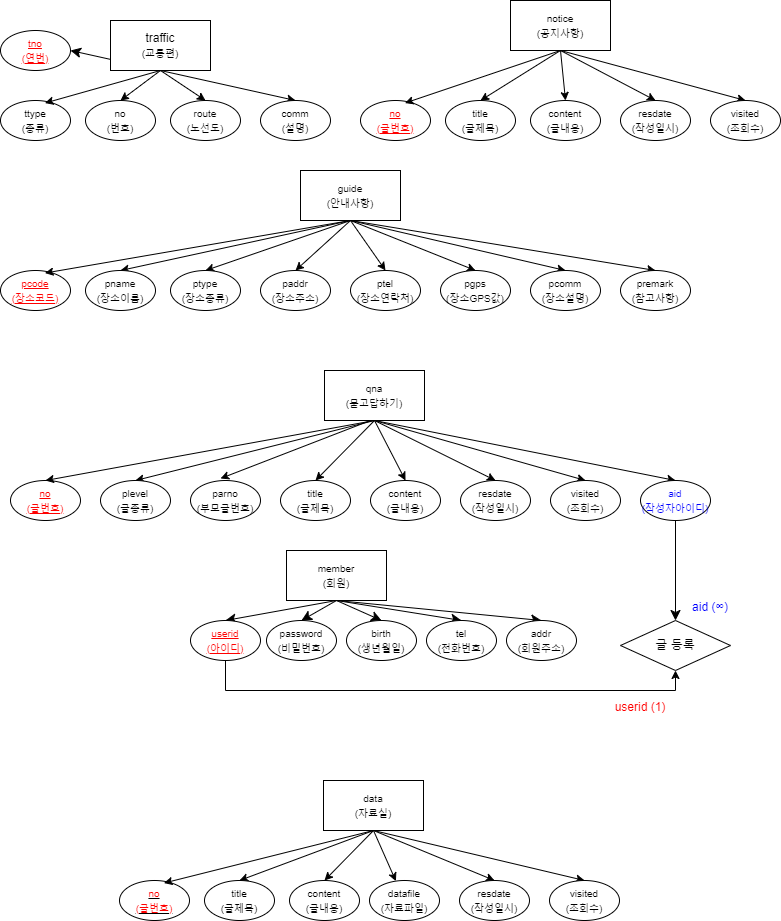
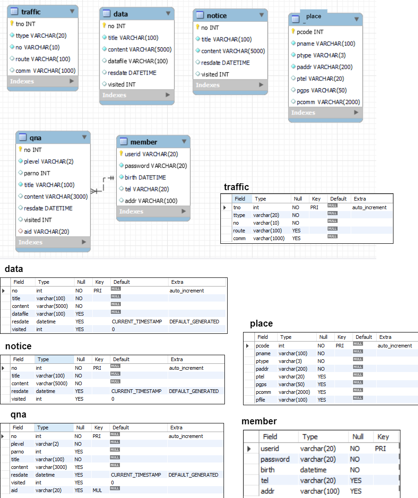

# Project Development Report (프로젝트 개발 보고서)
-------------------------------------------------
## 1. Project Outline (프로젝트 개요)

    은평구의 중심인 갈현동을 소개하는 자바 기반 웹 애플리케이션 개발 프로젝트

 

## 2. Project Purpose(프로젝트 목적)
    갈현동의 가장 큰 특징인 로데오거리를 중심으로, 대형시설, 구경거리, 맛집 등을 소개한다.

 

## 3. Project Development Information (프로젝트 개발환경 정보)
- Project Topic : Galhyeon-dong Intro Web Application

- Develope Environment : Open JDK 11

- Language : Java 11

- Web Module : Jsp/Servelet 3.0

- Process Pattern : MVC Pattern

- Database System(DBMS) : MySQL Server 8.0

- Database Design : MySQL Workbench 8.0 CE

- Entity Relationship Design : draw.io 20.8.16

- Java Database Connector : mysql-connector-java-8.0.30

- Application Design : Object aid 1.2.4

- Back Template Language : Java/Servlet 11

- Front Template Language : Jsp(JSTL/EL) 3.0 / HTML5 / CSS3 / Javascript ES5

- Web (Applcation) Server : Tomcat 9.0

- Navigation Design : WordCloud 3.7, Card Sort BoardMix

 

## 4. Project Planning & Design (프로젝트 기획 및 설계)

### 4-1. Navigation Design (네비게이션 설계)
| 우리 동네 소개 | 우리 동네 정보 | 커뮤니티 | 마이페이지 | 
|---------------|---------------|---------|------------|
| 지명유래 | 교통편 | 공지사항 | 회원약관 |
| 오시는 길 | 주요시설안내 | 자료실 | 개인정보처리방침 |
| &nbsp; | 맛집안내 | 묻고 답하기 | 로그인 |
| &nbsp; | &nbsp; | &nbsp; | 회원가입 |

#### 4-1-1. Data Collection And Sort - Word Cloud (자료 수집) 

#### 4-1-2. Content Sort - Card Sorting (콘텐츠 분류)

#### 4-1-3 Service Flow Design (서비스 흐름 설계) 

#### 4-1-4 Service User Scenario (서비스 시나리오)
**Member User Scenario (사용자 시나리오)**
1. 지역 소개인 지명 유래, 연혁 탐색
2. 지역소개 - 지역특징 및 시설 안내 탐색
3. 지도로 오시는 길 탐색
4. 교통편 탐색
5. 주요 빌딩 및 맛집 탐색
6. 이벤트, 특이사항 확인 위해 공지사항 글 확인
7. 공지사항 글 확인, 질문 위해 회원가입 시작
8. 회원가입 시작 ⇒ 회원 약관 및 개인정보 처리 방침 동의
9. 가입 페이지에서 필수정보 입력 후 아이디 중복확인 거쳐 가입완료
10. 로그인
11. 공지사항 글 확인, 해당 정보가 없는 경우 묻고 답하기로 이동
12. 묻고 답하기 페이지에서 궁금한 사항에 대한 답이 있는지 검색
13. 해당 정보가 있으면 묻고 답하기 글 확인, 없으면 질문 등록
14. 카탈로그, 가이드 있는지 확인 위해 자료실 탐색
15. 자료를 확인하고, 다운로드
    
**Administrator Scenario (관리자 시나리오)**
1. 관리자로 로그인
2. 공지사항 목록 확인, 누락 정보 확인
3. 이벤트나 특이사항을 공지사항으로 등록
4. 변동 내용 있는 경우 공지사항 수정
5. 취소된 내용 있는 경우 공지사항 삭제
6. 묻고 답하기로 이동하여 등록된 질문 확인하여 답변글 등록
7. 부적절한 글 있는 경우 삭제 
8. 카탈로그, 가이드 발생한 경우 자료실에 글, 자료 등록
9. 지역 소개에 대한 변동이 있는 경우 해당 페이지 내용 수정
10. 이용 안내에 대한 변동이 있는 경우 해당 페이지 내용 수정
11. 회원목록으로 이동하여 신규회원, 탈퇴회원 확인 + 제적 사유에 해당하는 회원 강퇴

### 4-2. Database Design (데이터베이스 설계)
\+ member Class addr => email로 수정

#### 4-2-1. 개념적 설계 

#### 4-2-2. 논리적 설계

#### 4-2-3. 물리적 설계
